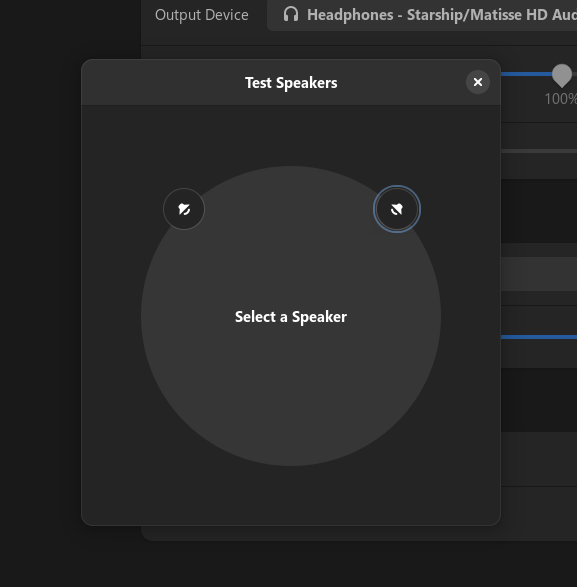

# sound-theme-frealtek
Default theme for the Realtek Sound Theme Specification

(The Realtek audio test sound instead of the default freedesktop sounds, i.e. front left, front right, front center)

## Notice

These sounds are owned by the Realtek people! I do not own these sounds, they belong to them not me.

## Installation

1. Clone this contents of this repo to `/usr/share/sounds/freedesktop/stereo`.

2. Try running the test sounds in GNOME settings

3. Profit

